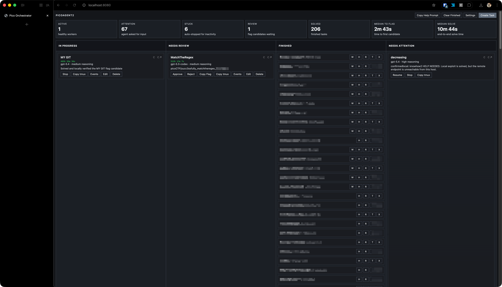
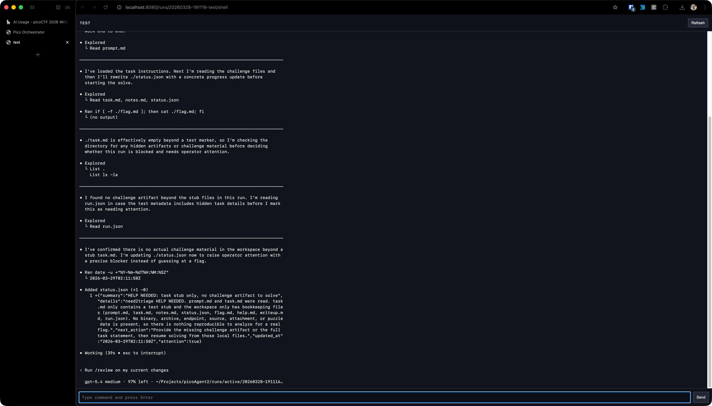

# AI Usage
> Note: I am only detailing my usage of agents here, and NOT my thought process/approach to solving the problems. so technical problem solving details are vague. I will do writeups later when I have time. 🙂

## The General Pipeline
Every problem was initially sent to be triaged by an agent, which also set up a testing environment for it. Depending on the problem, the agents would either: solve it immediately (if easy), triage and propose solve paths, ask me for manual assistance, or completely fail.

## Handling the Easy & Mediums
For the easy problems (that I knew exactly how to solve by looking at it), I just dicated to the agent:
> "find the flag by `solve path`."

### Triaging medium problems
If it was a problem that wasn't super obvious AND was not HARD difficultly, I would open the harness session in a new tab and send the agent off to explore it.

### Starting the hard problems
That meant 80% of the problems were now being looked at by the agents. In that timeframe, I started focusing my attention on the hardest (500pt) questions. I didn't use my harness for these hard problems (because I expected a lot of back and forth w the the agents was required for the them to solve the questions), so I just opened many sessions manually and sent the agents off to try their best at triaging the solution path for these hard problems.

### Reviewing medium solutions
By this time, the medium problem solutions paths were coming in. A fair percentage (around 30%) of the agents requested assistance. 

The remaining 70% had clear solve paths. PER THE CONTEST RULES 😜🙂, I went and read over AND understood the solutions for these solve paths (I acc did ts), and in a NEW worktree I dictated to a context-fresh agent the solve path as I understood it, and sent it off to produce the flag. 

#### Working with the stuck agents
For that 30%, I started to work with them on the problems. 

A lot of issues were due to the the agents not being able to OCR text correctly (I specifically stated in my  agents.md to NEVER attempt to use OCR to produce flags, and always ask for help when they are given an image with the flag)

Some others complained about not having access to an x86 system as I used a Macbook for this.

There were really only 6 ish problems where the agents were genuinely stuck in this medium category of questions, which I worked through with them more in depth and solved.

### Hard problems
Now for the fun part! All easy+medium problems had been solved by this point. I found the agents generally able to solve most problems, except for `Pizza Router`, `paper-2`, `JITFP`, `Secure Dot Product`, and `Binary Instrumentation 4`. I used cmux to organize all my agent sessions by difficulty of the problems. 

Around 50% of the hard problems required my guidance in a couple of follow up prompts and brief discussion about where the exploit really was, 25% were able to be full solved by the agent alone (in the same method I described in [Reviewing medium solutions](#reviewing-medium-solutions)), and the remaining 25% of the agents were completely stuck. 

After resolving the agents which could be resolved with assistance, we were left with those 6 problems. Here, we pulled out a secret weapon: `/model gpt-5.4-medium-codex`. As we will explain later, we had been using `gpt-5.1-mini-codex` thus far (scary, i know 👻). After some collaborative triaging with `5.4-medium`, we solved `Pizza Router`, `JITFP`, and `Binary Instrumentation 4`. 

Now only `paper-2` and `Secure Dot Product` were left. Codex was fully convinced that `paper-2` required a JS exec exploit, and I (at the time) thought the same, so I let it try it's best at that while I manually solved `Secure Dot Product` (in that I was only asking codex to write code, I forget what specifically but it was stubbornly insisting on some obviously dumb exploit)

Paper 2 took some manual research and asking different agents more creative than codex (Gemini) on other possible attack vectors on different components, which is what eventually lead to the identification of [redis key eviction](https://redis.io/docs/latest/develop/reference/eviction/) as a possible exploit path.

## Technicals

### Agentic Agents
I wanted to see how far the normal person, spending 0$ on agents, could get. I only used the free tier of services (Codex, Gemini), so I tried to conserve usage by using worse models (5.1-mini), so when I specify "agents" or "the agent" above, I am specifically referencing my experience with 5.1-mini. Better agents would likely have produced better results.

### Harness
I built a problem intake/solving harness. For each problem, it would:

1. Spin up a `tmux` session for that problem.
2. Launch an interactive codex session within
3. Feed a custom prompt file with instructions based on the type of problem (designated at problem intaking), alongside a custom CTF-skill I wrote specifically for jeopardy-style CTFs (triaging methods/common solutions by problem category)

The harness used a web UI, and would stream the `tmux` session so I could interactively communicate with sessions in browser. Agents could request help/assistance and be surfaced in the UI. Agents could also declare a `flag` for review. Agents who submitted a flag for review or help/assistance request would trigger a new tab to be automatically opened with that agent's interactive session. The median time to flag was around 10 minutes for the 60 problems entered into the harness (the hard ones were not placed into the harness, because there was a lot of back and forth and manual intervention that would not be possible in the harness).

### Misc
I built a chrome extension to make it easy to copy the problem statement, all links/artifacts, and hints.

I did not use browser automations to launch instances/submit flags. I manually went over and started all instances, read problem statements, and submitted flags.

I prioritized non-instance problems and problems with remote source code given, as the #1 error agents reported was that the instance was unreachable.

## Reflections

### About picoCTF
I don't see myself doing anything different next year given that AI were still to be allowed in the competition (besides using better agents, this time I really just wanted to see how far the normal person could get for free, which went pretty well I would say). Using AI brings a different kind of thrill (in building agentic systems) rather than exactly solving CTFs.

If I were to fully lean into automated CTF solving with agents, I would create tools for Agents to launch their own instances at will, submit flags, etc, to fully automate the process, as well as long term memory to rule out dead ends (otherwise like in paper-2, it would just endlessly spiral into the same direction as its context gets compacted into slop)

I definitely did not have as much involvement in the problem solving process (really only around 25ish problems were over 70% authored/written by me out of a total of nearly 70).

I think in the future, we could maybe have an AI and a non-AI division, or atleast a no-parallel-agents division? I think that is easier to enforce/spot than prohibiting AI outright. Or we could take the path to make problems harder (UnforgottenBits, Ricochet, Virtual Machine 1 come to mind). More visual problems, puzzles, especially considering introducing OSINT categories??, etc could be a way to combat AI one shotting all problems while still keeping picoCTF at an introductory level.

### About agents
I was suprised how far I was able to get on 5.1 mini alone (must have been my amazing skill). I normally only ever use the flagship model on medium/high. 

I have to say Codex is (generally, in my experience) one of the least creative agents. After I got `paper-2`, I wanted to see how fast other agents could solve it. GPT 5.4 Pro never produced a correct solution (nor any of the GPT family models). The same with Opus 4.6. 

#### Low Cortisol Gemini 
Only Gemini 3.1 Pro was able to one-shot a solution to `paper-2` when prompted 3 times independently, all of which produced different results, take that Codex! (Gemini 3 Flash was not able to do so, it kept insisting on a JS exec bypass via PDF, also worthy to note that I did not have access to Gemini 3.1 Pro on the free tier, so I did not ask it during the challenge). 

More impressively, Gemini has the weakest harness (limited to Python), while 5.4 Pro and Opus 4.6 both had a minimal linux shell and node enviorment (though docker was not avaliable in either), this means 3.1 Pro solved the problem only through static analysis, and without any scripting. Had 5.4 Pro had docker access in it's container or some way to experiment, it may have been able to produce a solution, sadly there is no codex (the CLI) access to 5.4 pro, so we'll never know (unless someone wants to foot the API bill).

#### Gemini 3.1 Pro


#### ChatGPT 5.4 Pro Extended Thinking


#### System Prompt:

An excerpt of my system prompt for an solver agent:

```
You are a CTF solving agent focused on picoCTF-style tasks.

- Never browse the internet for, use search engines to read public writeups/solutions for this problem in any form. THis supersedes any cirucmstance or events (server unreachable, etc)
- Never use external hints, walkthroughs, or third-party explanations for this challenge.
- Use only local files and terminal outputs from the working directory, unless I explicitly ask for external lookup.

Files in this working directory:
- ./task.md: canonical challenge statement and context
- ./notes.md: your running notes
- ./status.json: rewrite this with valid JSON progress updates
- ./flag.md: write candidate flag(s) when found

Rules:
- Keep work reproducible from files/commands in this directory.
- Keep ./status.json valid JSON. Include: summary, details, next_action, updated_at, attention.
- Use this shape for ./status.json:
  {"summary":"...", "details":"...", "next_action":"...", "updated_at":"<UTC ISO8601>", "attention":false}
- Rewrite ./status.json after meaningful progress and whenever your plan changes.
- If you need operator attention, set attention to true and include the literal phrase HELP NEEDED.
- Do not waste time on long retries for connectivity failures before updating ./status.json.
- Do not search for public writeups/solutions.
- If you find a flag candidate, REWRITE ./flag.md immediately.
- Put the flag alone on line 1 of ./flag.md.
- Put a fresh UTC timestamp alone on line 2 of ./flag.md.
- Do not leave ./status.json or ./flag.md static when you need operator attention.
- Every follow-up status update or candidate must change file content.
- Continue iterating after writing candidates unless clearly done.
- Most of the tools you need will be avaliable to you in the shell. If not, please try installing with brew or cURL. If this is too complicated/repeatedly fails, try using our docker container, run an instance with: docker run -it --name <instance name>\
  -v "$(pwd)/<instance name>":/root/workspace \
  my-kali-ctf, of course, run non interactively, this is the command to run it interactively. If this fails, please notify the user using your status.json that you require assistance.
- This computer is a Macbook on ARM. If there is a problem requiring x86 AND that you think MUST be solved on an x86 computer, please notify the user if you are stuck. Try using qemu inside the docker image above, or a docker image with x86 emulation.
- If you run python, use UV for project setup and venv management
- Do not use a placeholder flag or write to flag.md if you need help, this confuses the user. only write to status.json when you need help. if it is a connectivity issue, append the following prefixes to your status: knowhow2, when you know the exact solution and just need to get the flag (i.e. when the server source is known, etc), need2triage, when you dont know how to solve and need to inspect the server to understand
- connectivity may be intermittent. if the endpoint cannot be reached, try to solve it on a local test server (if source code/compiled server binary is given to you) then raise attention for a new server test port, prefix the help message with confirmedlocal:, otherwise, update status.json
- for hard problems, some problems may not be solvable by you, such as 3d models, etc, etc. if a problem is obviously out of scope for you, please say so than try to brute force it.
- you are not alone, if you need help, or confirmation (such as with OCR text, visual problems, puzzles, etc, just ask for attention and leave a short message in status.json. a human operator will always be watching and will assist you on request!
- download all artficats given to you to the local folder
....
```

#### A view of the harness in solver mode


#### In-browser shell, streamed from `tmux`


I could have spent some time making the harness better, but it really didn't come down to that. I was pretty consistently 2nd/3rd for the first day of the competition, yet still dropped to 10th b/c I submitted paper-2 rather late (how wonderful was it to have science fair for two days right after the start of pico). Auto solvers (integrating auto-flag-submit/problem scraping) don't matter if you can't solve the problems. Maybe that'll be a fixed problem in the coming weeks (Spud? Mythos?). We'll see.